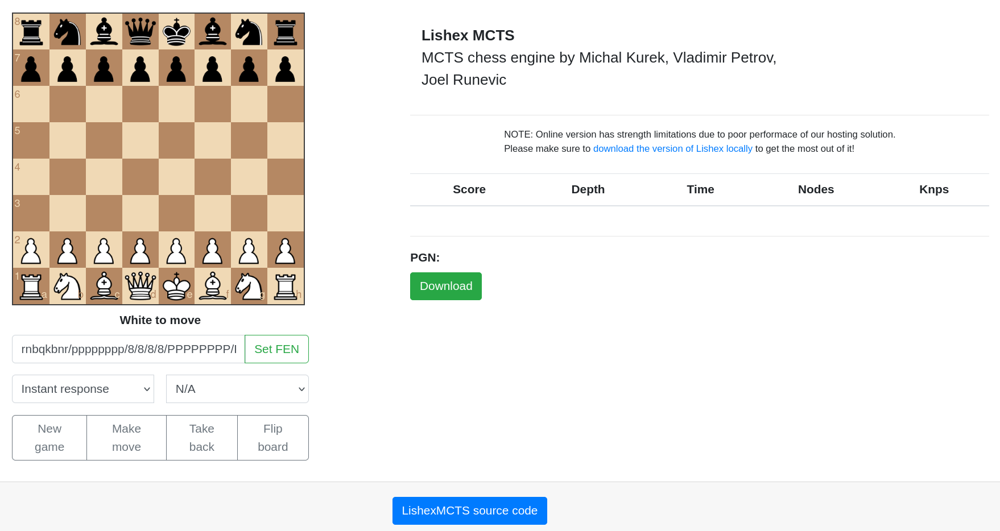

# Web based GUI for UCI chess engine
A simple web based GUI to play versus Lishex. 
Fork of original Flask web GUI by Maksim Korzh.

# PLAY ONLINE

# Features
 - online play
 - flip board
 - force computer move
 - fixed time mode
 - fixed depth mode
 - set FEN
 - download PGN
 
 # Used packages
 - Flask (minimalist WEB framework)
 - python-chess (chess library to communicate with engine over UCI protocol)
 - chessboardjs (chess board widget)
 - chessjs (chess library to keep track of the game state in the UI)
 
 # How to run it locally
  - install Python 3.6 or higher
  - install flask via "pip install flask"
  - install python chess via "pip install python-chess"
  - clone repo, cd into /src and run command "python app.py"
  - open browser, navigate to "localhost:5000"
  
# Credit
Huge thanks to [Maksim Korzh](https://github.com/maksimKorzh), whose repository this is a fork and modification of.
